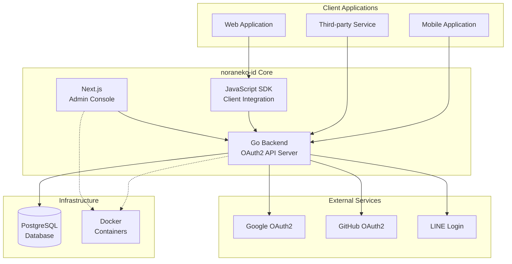

# 📚 noraneko-id Documentation

日本の開発者向けIDaaS（Identity as a Service）「noraneko-id」の技術文書ポータルです。

## 🎯 プロジェクト概要

**noraneko-id** は、日本のプライベートサービス開発者向けに設計されたIDaaS（Identity as a Service）システムです。OAuth2準拠の認証基盤を提供し、プライバシーを重視した設計でサードパーティクッキーを使用しません。

### 主要特徴
- 🎌 **日本語対応**: 完全な日本語UI・文書・エラーメッセージ
- 🔒 **プライバシー重視**: サードパーティクッキー不使用
- 🏢 **マルチテナント**: クライアント別完全データ分離
- 📱 **SNS連携**: Google・GitHub・LINE等の統合認証
- 🛡️ **セキュリティ**: OAuth2 RFC準拠 + PKCE対応

## 📁 文書構成

### 🏗️ [Backend Documentation](./backend/)
**Go言語で実装されたAPIサーバーの技術文書**

- [アーキテクチャ設計](./backend/BACKEND_ARCHITECTURE.md) - システム設計・マルチテナント・セキュリティ
- [ユースケース図](./backend/USE_CASES.md) - PlantUML形式のユースケース詳細
- [シーケンス図](./backend/SEQUENCE_DIAGRAMS.md) - OAuth2・SNS連携・認証フロー
- [データフロー図](./backend/DATA_FLOW.md) - システム内部データ処理フロー
- [API仕様書](./backend/API_REFERENCE.md) - **完全なREST API仕様**

### 🖥️ [Web Administration Console](./web/)
**Next.js実装の管理コンソール文書**

- システム管理画面の技術仕様
- Component設計・アーキテクチャ
- デプロイ・運用ガイド
- *（一部文書作成予定）*

### 📦 [JavaScript SDK](./javascript-sdk/)
**クライアント統合用JavaScript SDK文書**

- [SDK要件仕様](./javascript-sdk/javascript-sdk-requirements.md) - 機能要件・API設計
- TypeScript対応・React統合
- Next.js Server Components対応
- *（追加文書作成予定）*

### ⚙️ [General Project Documents](./general/)
**プロジェクト全体の開発文書**

- [開発環境構築](./general/DEVELOPMENT.md) - セットアップ・依存関係
- [開発ワークフロー](./general/WORKFLOW.md) - Git・PR・リリースフロー
- [テスト戦略](./general/TESTING.md) - テスト方針・CI/CD

## 🚀 クイックスタート

### 🔍 目的別ガイド

#### 新規開発者（システム理解）
```
1. general/DEVELOPMENT.md     # 開発環境構築
2. backend/BACKEND_ARCHITECTURE.md  # システム全体像
3. backend/USE_CASES.md       # 機能要件理解
4. 各コンポーネント詳細文書
```

#### API統合開発者
```
1. backend/API_REFERENCE.md   # API仕様確認
2. backend/SEQUENCE_DIAGRAMS.md  # 認証フロー理解
3. javascript-sdk/           # SDK利用検討
4. 実装・テスト開始
```

#### システム管理者・運用者
```
1. web/                      # 管理コンソール操作
2. backend/DATA_FLOW.md      # データ処理理解
3. general/TESTING.md        # 監視・テスト設定
```

#### 貢献者・開発参加者
```
1. general/WORKFLOW.md       # 開発フロー確認
2. backend/BACKEND_ARCHITECTURE.md  # 技術理解
3. 担当コンポーネント詳細文書
```

## 🏗️ システム構成



## 📊 開発状況

### ✅ 実装完了
- **Backend API**: OAuth2・SNS連携基盤・マルチテナント
- **Database Schema**: PostgreSQL完全スキーマ
- **基本認証**: パスワード・セッション・JWT
- **管理コンソール**: 基本機能実装済み

### 🚧 開発中
- **SNS連携**: Google・GitHub・LINE実装
- **JavaScript SDK**: TypeScript・React統合
- **管理機能**: 統計・ログ・監視機能
- **テストスイート**: 統合・E2Eテスト

### 📋 今後予定
- **本番環境**: Docker・CI/CD・監視
- **追加SNS**: Apple・Twitter連携
- **SDK拡張**: Vue.js・Mobile SDK
- **機能拡張**: WebHook・監査ログ

## 🔧 技術スタック

| Component | Technology | Version | Status |
|-----------|------------|---------|--------|
| **Backend** | Go + Gin | 1.21+ | ✅ 実装済み |
| **Database** | PostgreSQL | 16+ | ✅ 実装済み |
| **Web Console** | Next.js + TypeScript | 14+ | 🚧 開発中 |
| **JavaScript SDK** | TypeScript + React | 5+ / 18+ | 📋 設計完了 |
| **Infrastructure** | Docker + Compose | Latest | ✅ 開発環境 |

## 🤝 貢献・サポート

### 開発参加
1. [WORKFLOW.md](./general/WORKFLOW.md) でGitフロー確認
2. GitHub Issue で機能提案・バグ報告
3. Pull Request で実装・修正貢献

### 質問・サポート
- **GitHub Issues**: バグ報告・機能リクエスト
- **GitHub Discussions**: 一般的な質問・ディスカッション
- **Email**: [support@noraneko-id.com](mailto:support@noraneko-id.com)

### 外部リソース
- **OAuth2 RFC**: [RFC 6749](https://tools.ietf.org/html/rfc6749)
- **OpenID Connect**: [Specifications](https://openid.net/developers/specs/)
- **セキュリティガイド**: [OAuth 2.0 Security Best Current Practice](https://tools.ietf.org/html/draft-ietf-oauth-security-topics)

## 📝 文書メンテナンス

### 更新頻度
- **API仕様**: 機能追加・変更時に即座更新
- **アーキテクチャ**: 設計変更時に更新
- **ガイド**: リリース毎に見直し

### 文書品質
- **正確性**: 実装との整合性を常に維持
- **完全性**: 必要な情報を網羅
- **可読性**: 日本語での明確な説明

---

📅 **Last Updated**: 2024-06-15  
🔄 **Version**: v1.0.0  
🌟 **Project Status**: Alpha - Core Implementation Complete  
👥 **Maintainers**: noraneko-id development team

---

## 🔗 Quick Links

- [🚀 Getting Started](./general/DEVELOPMENT.md)
- [📋 API Documentation](./backend/API_REFERENCE.md)
- [🏗️ Architecture Overview](./backend/BACKEND_ARCHITECTURE.md)
- [⚙️ Development Workflow](./general/WORKFLOW.md)