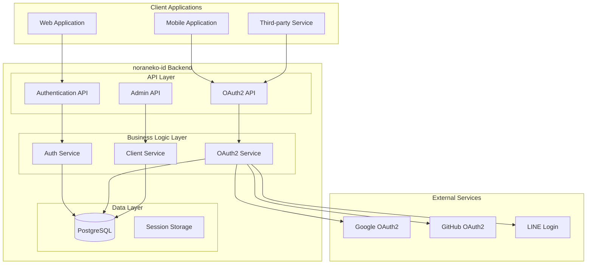
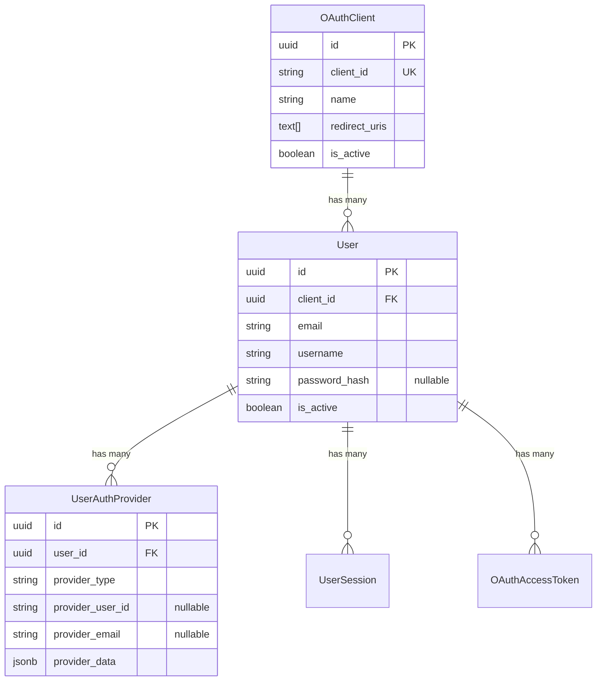
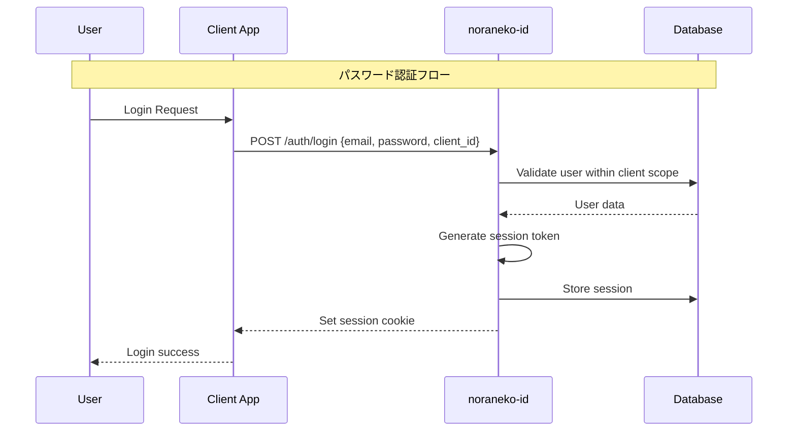
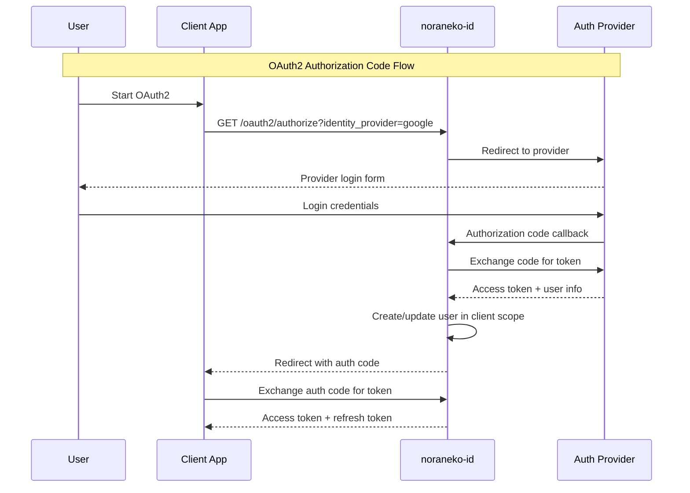

# Backend Architecture

noraneko-id バックエンドのアーキテクチャ設計と技術構成について説明します。

## システム概要



## レイヤードアーキテクチャ

### 1. API Layer (`/internal/handler`)
```
/internal/handler/
├── auth.go      # 認証エンドポイント
├── oauth2.go    # OAuth2エンドポイント
└── client.go    # クライアント管理
```

**責務:**
- HTTPリクエスト/レスポンス処理
- リクエスト検証とパラメータ変換
- エラーハンドリングとレスポンス整形

### 2. Business Logic Layer (`/pkg`)
```
/pkg/
├── oauth2/      # OAuth2サービス
├── jwt/         # JWT処理
└── database/    # データベース接続
```

**責務:**
- ビジネスロジックの実装
- データ変換とバリデーション
- 外部サービス連携

### 3. Data Layer (`/internal/model`)
```
/internal/model/
└── models.go    # データモデル定義
```

**責務:**
- データモデル定義
- データベーススキーマ管理
- GORM設定とリレーション

## マルチテナント設計

### テナント分離戦略



### 分離レベル
- **完全分離**: クライアントごとに独立したユーザーベース
- **データ分離**: 同一データベース内で論理分離
- **認証分離**: クライアント別認証スコープ

## セキュリティアーキテクチャ

### 認証フロー



### OAuth2認証フロー



## データベース設計

### 主要テーブル構成

```sql
-- クライアント管理
CREATE TABLE o_auth_clients (
    id UUID PRIMARY KEY DEFAULT gen_random_uuid(),
    client_id VARCHAR UNIQUE NOT NULL,
    client_secret_hash VARCHAR NOT NULL,
    name VARCHAR NOT NULL,
    redirect_uris TEXT[],
    is_active BOOLEAN DEFAULT true
);

-- マルチテナントユーザー
CREATE TABLE users (
    id UUID PRIMARY KEY DEFAULT gen_random_uuid(),
    client_id UUID NOT NULL REFERENCES o_auth_clients(id),
    email VARCHAR NOT NULL,
    password_hash TEXT, -- nullable for SNS-only users
    username VARCHAR NOT NULL,
    is_active BOOLEAN DEFAULT true,
    UNIQUE(client_id, email),
    UNIQUE(client_id, username)
);

-- 認証プロバイダー管理
CREATE TABLE user_auth_providers (
    id UUID PRIMARY KEY DEFAULT gen_random_uuid(),
    user_id UUID NOT NULL REFERENCES users(id),
    provider_type VARCHAR NOT NULL,
    provider_user_id VARCHAR,
    provider_email VARCHAR,
    provider_data JSONB,
    is_verified BOOLEAN DEFAULT false
);
```

### インデックス戦略

```sql
-- マルチテナント検索最適化
CREATE INDEX idx_users_client_email ON users(client_id, email);
CREATE INDEX idx_users_client_username ON users(client_id, username);

-- プロバイダー検索最適化
CREATE INDEX idx_user_auth_providers_user_provider 
ON user_auth_providers(user_id, provider_type);

CREATE INDEX idx_user_auth_providers_provider_id 
ON user_auth_providers(provider_type, provider_user_id);
```

## API設計パターン

### RESTful API構成

```
GET    /health                           # ヘルスチェック
POST   /auth/register                    # ユーザー登録
POST   /auth/login                       # ログイン
POST   /auth/logout                      # ログアウト
GET    /auth/profile                     # プロフィール取得
GET    /auth/providers                   # サポートプロバイダー一覧

GET    /oauth2/authorize                 # OAuth2認可エンドポイント
POST   /oauth2/authorize                 # OAuth2同意処理
POST   /oauth2/token                     # トークンエンドポイント
GET    /oauth2/userinfo                  # ユーザー情報エンドポイント
POST   /oauth2/revoke                    # トークン取り消し

POST   /admin/clients                    # クライアント作成
GET    /admin/clients                    # クライアント一覧
GET    /admin/clients/:id                # クライアント詳細
PUT    /admin/clients/:id                # クライアント更新
DELETE /admin/clients/:id                # クライアント削除
```

### エラーレスポンス形式

```json
{
  "error": "invalid_request",
  "message": "リクエストの形式が正しくありません",
  "details": "validation error details"
}
```

## パフォーマンス設計

### データベース最適化
- **接続プール**: GORM標準プール設定
- **クエリ最適化**: N+1問題の回避
- **インデックス**: マルチテナント検索用複合インデックス

### メモリ管理
- **セッション**: Redis/PostgreSQLハイブリッド
- **トークン**: JWT + データベースハッシュ
- **キャッシュ**: クライアント情報のメモリキャッシュ

### スケーラビリティ
- **水平スケーリング**: ステートレス設計
- **ロードバランシング**: セッション親和性不要
- **データベース**: 読み取りレプリカ対応

## 監視・ログ設計

### ログレベル
```go
// 本番環境
log.Info("User login successful", "user_id", userID, "client_id", clientID)

// 開発環境
log.Debug("OAuth2 request details", "params", params)

// エラー
log.Error("Database connection failed", "error", err)
```

### メトリクス監視
- API レスポンス時間
- データベースクエリ実行時間
- 認証成功/失敗率
- アクティブセッション数

## セキュリティ考慮事項

### 脆弱性対策
- **SQLインジェクション**: GORM ORM使用
- **XSS**: テンプレート自動エスケープ
- **CSRF**: SameSite Cookie設定
- **セッション固定**: ログイン時セッション再生成

### 暗号化
- **パスワード**: bcrypt (cost=12)
- **セッショントークン**: SHA-256ハッシュ
- **JWT**: RS256署名
- **クライアントシークレット**: SHA-256ハッシュ

### レート制限
```go
// 実装予定
rate_limit := map[string]int{
    "/auth/login":    "5 requests per minute",
    "/auth/register": "3 requests per minute", 
    "/oauth2/token":  "10 requests per minute",
}
```