# Data Flow Diagrams - データフロー図

noraneko-id バックエンドのデータフローを図解で説明します。

## 1. システム全体データフロー

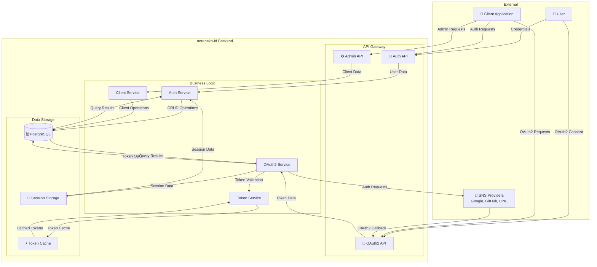

## 2. ユーザー登録データフロー

### 2.1 パスワード認証ユーザー登録

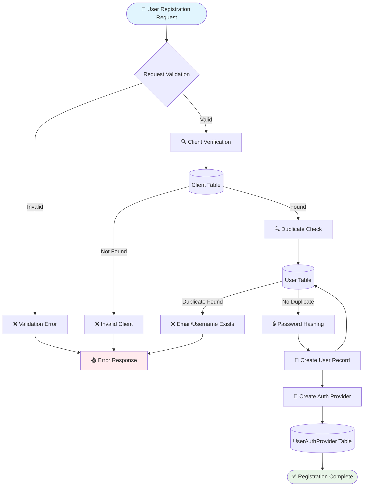

### 2.2 SNS連携ユーザー登録

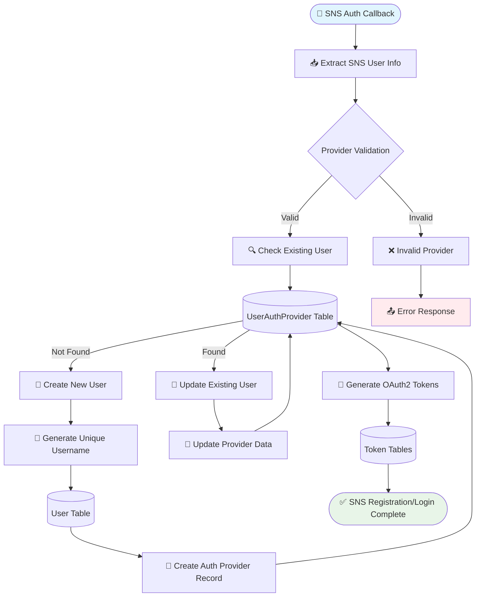

## 3. 認証データフロー

### 3.1 ログイン認証フロー

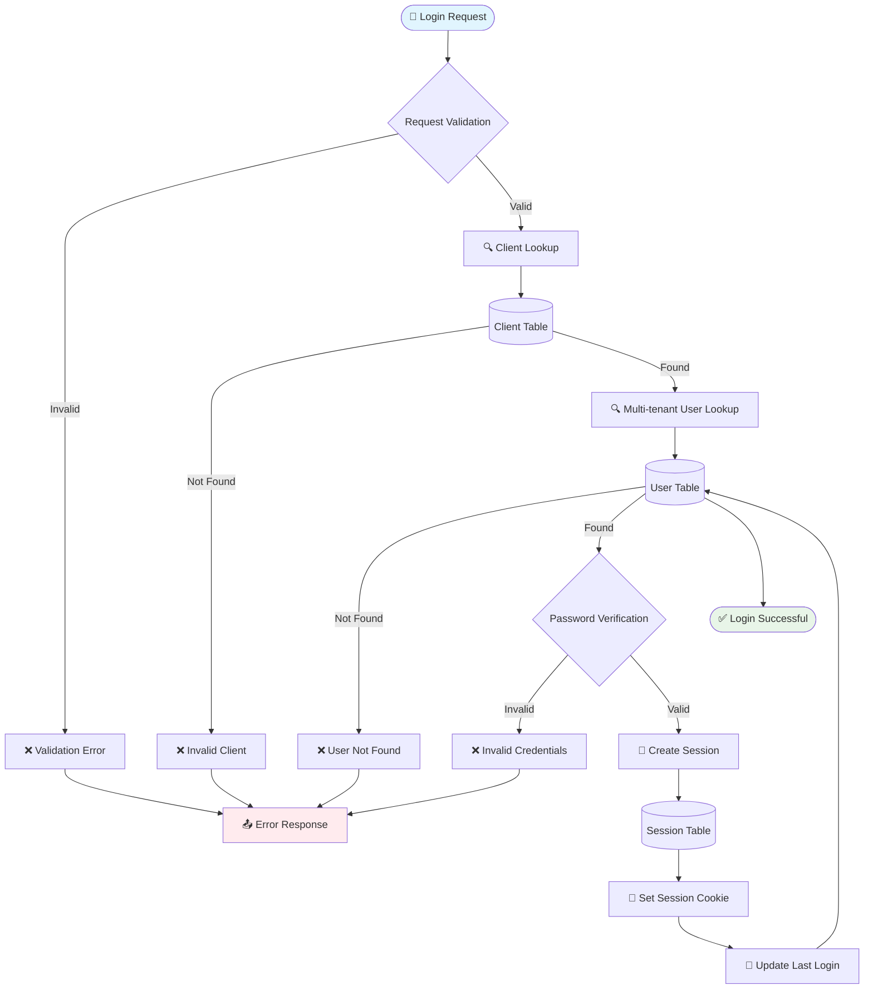

### 3.2 セッション検証フロー

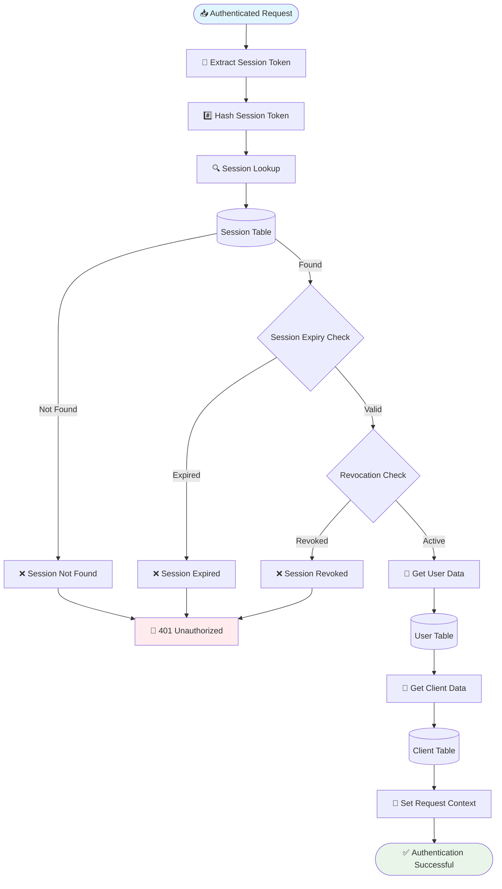

## 4. OAuth2トークンフロー

### 4.1 アクセストークン発行フロー

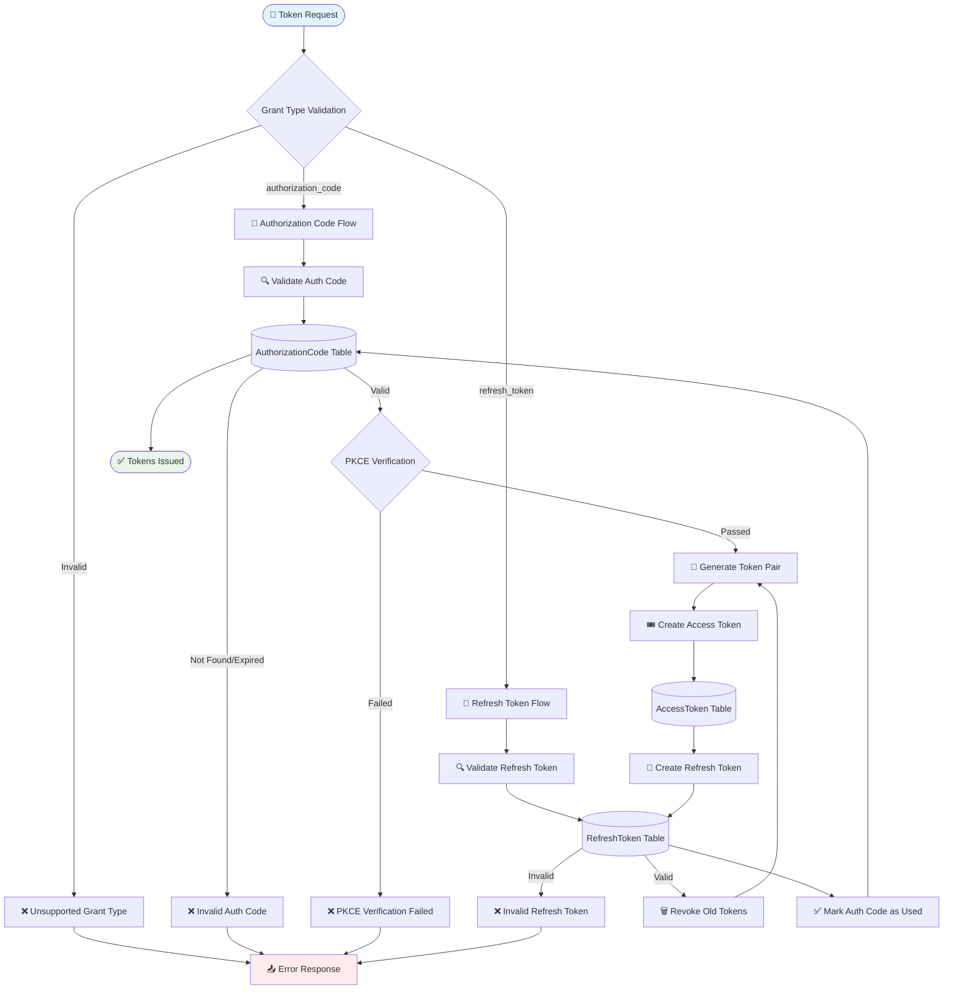

### 4.2 トークン検証・取り消しフロー

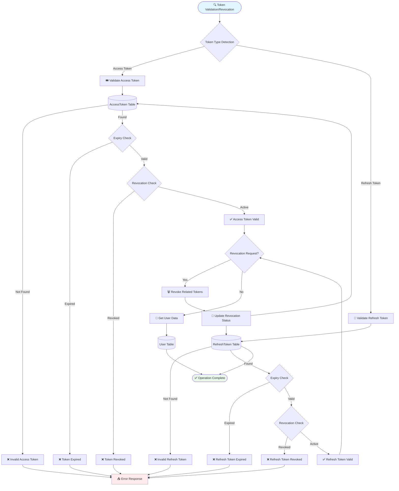

## 5. マルチテナントデータ分離フロー

### 5.1 テナント分離検証フロー

```mermaid
graph TD
    Start([📥 Client Request]) --> ExtractClientID[🏢 Extract Client ID]
    
    ExtractClientID --> ValidateClient[🔍 Validate Client]
    ValidateClient --> ClientDB[(Client Table)]
    
    ClientDB -->|Not Found| Error1[❌ Invalid Client]
    ClientDB -->|Inactive| Error2[❌ Client Inactive]
    ClientDB -->|Valid| SetTenantContext[🎯 Set Tenant Context]
    
    SetTenantContext --> UserOperation{User Operation Type}
    
    UserOperation -->|Read| ReadUserScoped[👤 Read User (Tenant Scoped)]
    UserOperation -->|Write| WriteUserScoped[✏️ Write User (Tenant Scoped)]
    UserOperation -->|Delete| DeleteUserScoped[🗑️ Delete User (Tenant Scoped)]
    
    ReadUserScoped --> UserDB[(User Table)]
    WriteUserScoped --> UserDB
    DeleteUserScoped --> UserDB
    
    UserDB -->|Query: WHERE client_id = tenant| TenantFilteredData[🎯 Tenant-Filtered Data]
    
    TenantFilteredData --> ProviderOperation{Provider Operation?}
    
    ProviderOperation -->|Yes| ProviderDB[(UserAuthProvider Table)]
    ProviderOperation -->|No| Success[✅ Operation Complete]
    
    ProviderDB -->|Query: WHERE user_id IN tenant_users| Success
    
    %% Error Paths
    Error1 --> ErrorResponse[📤 Error Response]
    Error2 --> ErrorResponse
    
    style Start fill:#e1f5fe
    style Success fill:#e8f5e8
    style ErrorResponse fill:#ffebee
```

### 5.2 マルチテナント重複チェックフロー

```mermaid
graph TD
    Start([🔍 Duplicate Check Request]) --> GetTenantContext[🎯 Get Tenant Context]
    
    GetTenantContext --> CheckType{Check Type}
    
    CheckType -->|Email| EmailCheck[📧 Email Duplicate Check]
    CheckType -->|Username| UsernameCheck[👤 Username Duplicate Check]
    CheckType -->|Provider| ProviderCheck[🔗 Provider User ID Check]
    
    EmailCheck --> EmailQuery[🗃️ Query: SELECT COUNT(*) FROM users<br/>WHERE client_id = ? AND email = ?]
    UsernameCheck --> UsernameQuery[🗃️ Query: SELECT COUNT(*) FROM users<br/>WHERE client_id = ? AND username = ?]
    ProviderCheck --> ProviderQuery[🗃️ Query: SELECT COUNT(*) FROM user_auth_providers p<br/>JOIN users u ON p.user_id = u.id<br/>WHERE u.client_id = ? AND p.provider_type = ?<br/>AND p.provider_user_id = ?]
    
    EmailQuery --> UserDB[(User Table)]
    UsernameQuery --> UserDB
    ProviderQuery --> JoinTables[🔗 Join Users + Providers]
    
    JoinTables --> UserDB
    JoinTables --> ProviderDB[(UserAuthProvider Table)]
    
    UserDB --> EvaluateResult{Result Evaluation}
    ProviderDB --> EvaluateResult
    
    EvaluateResult -->|Count > 0| Duplicate[❌ Duplicate Found]
    EvaluateResult -->|Count = 0| NoDuplicate[✅ No Duplicate]
    
    Duplicate --> RejectOperation[🚫 Reject Operation]
    NoDuplicate --> AllowOperation[✅ Allow Operation]
    
    style Start fill:#e1f5fe
    style AllowOperation fill:#e8f5e8
    style RejectOperation fill:#ffebee
```

## 6. 管理機能データフロー

### 6.1 クライアント管理フロー

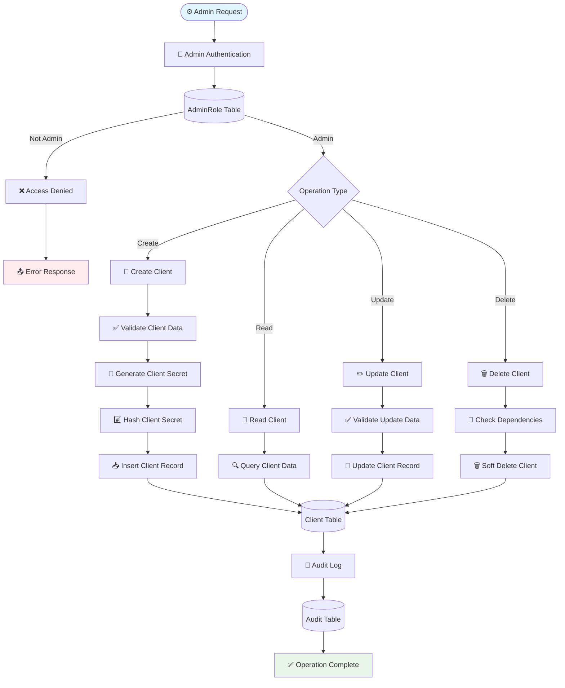

### 6.2 ユーザー管理フロー

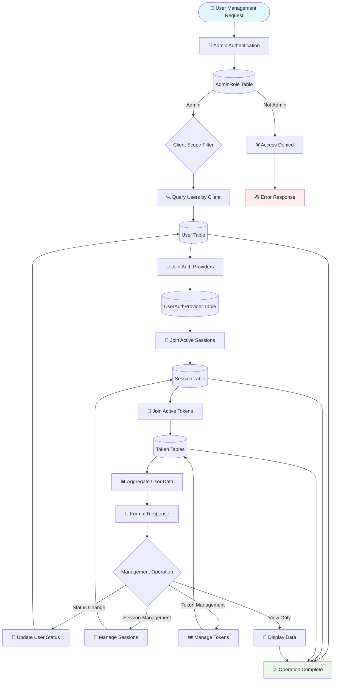

## 7. セキュリティデータフロー

### 7.1 レート制限フロー

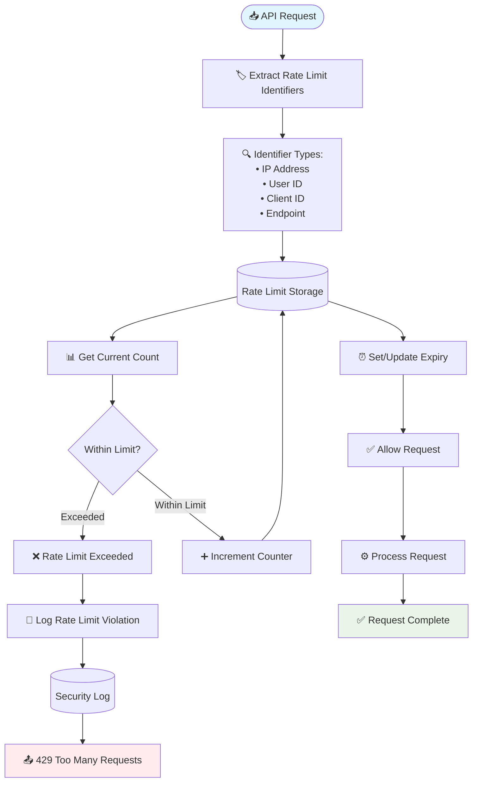

### 7.2 セキュリティログフロー

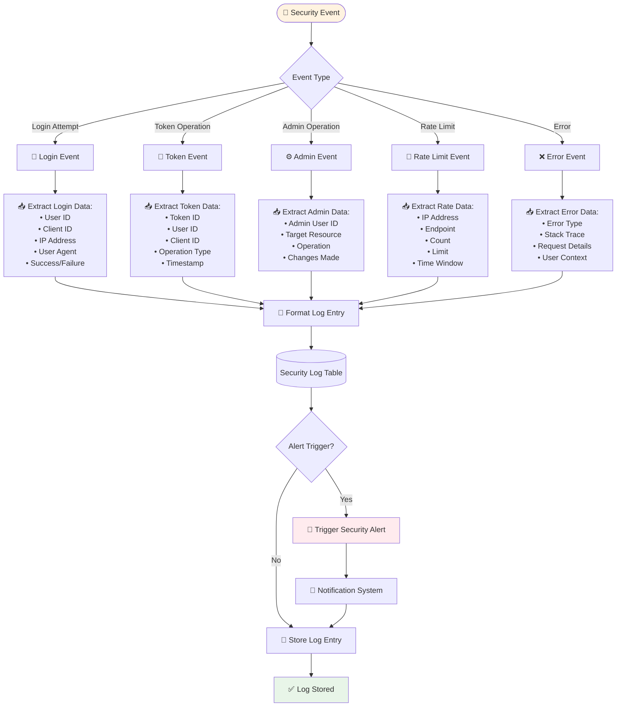