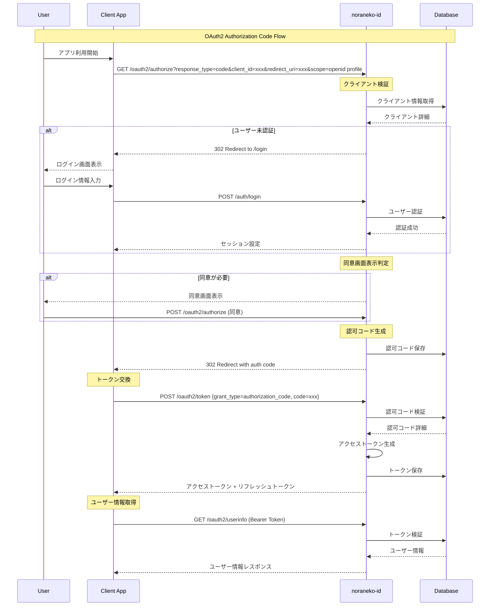
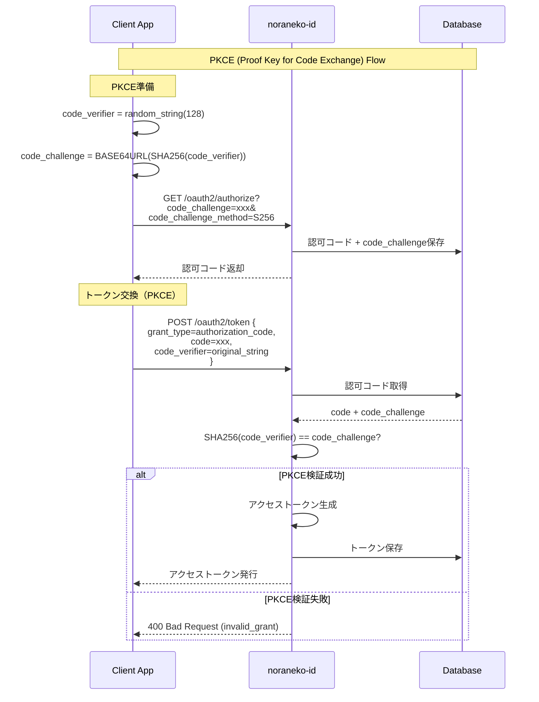
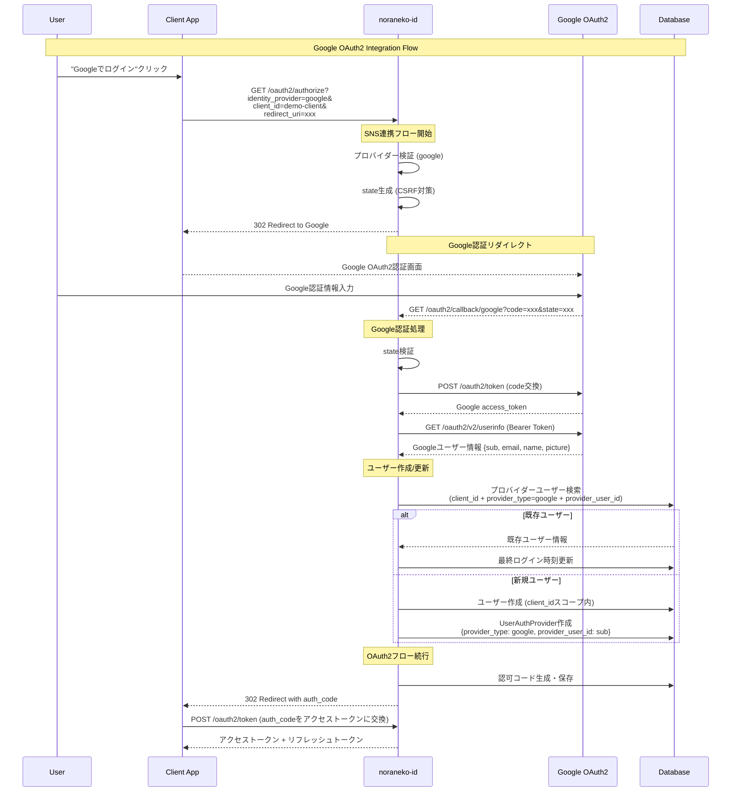
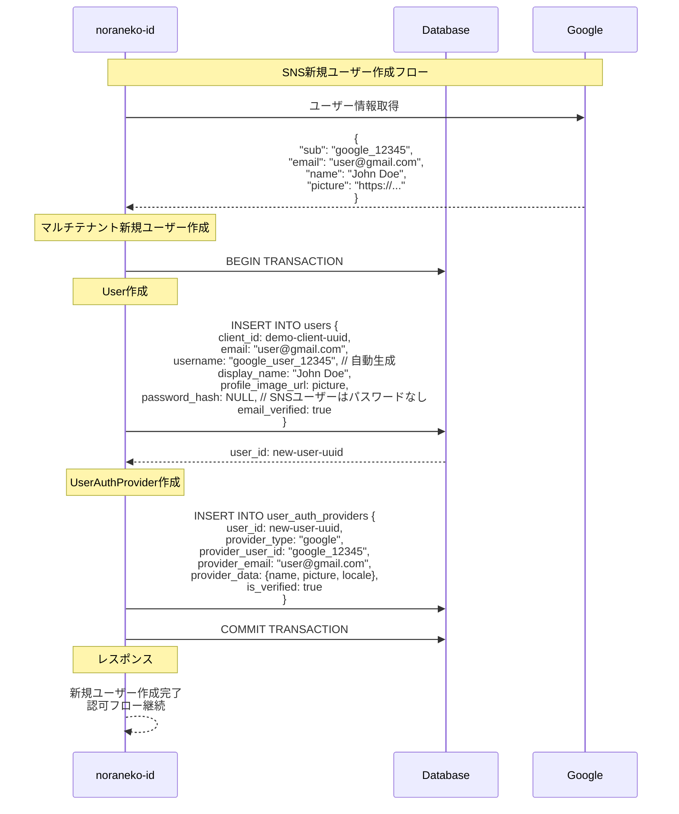
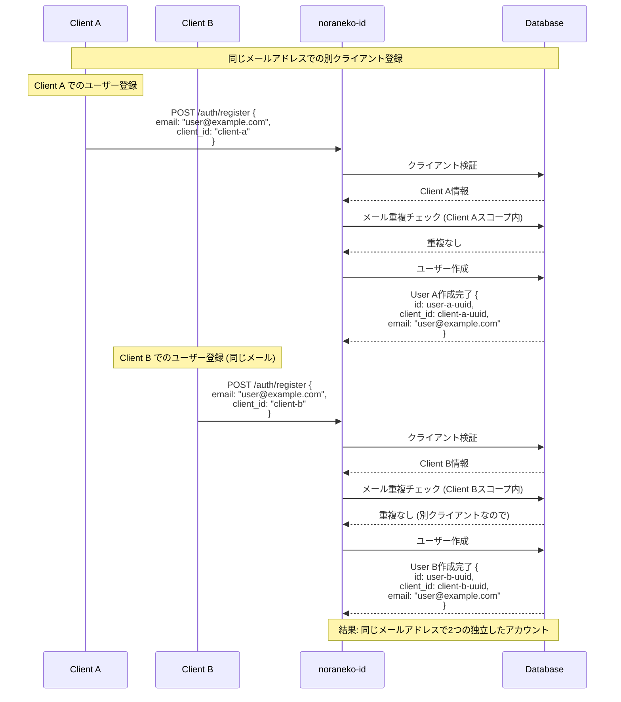
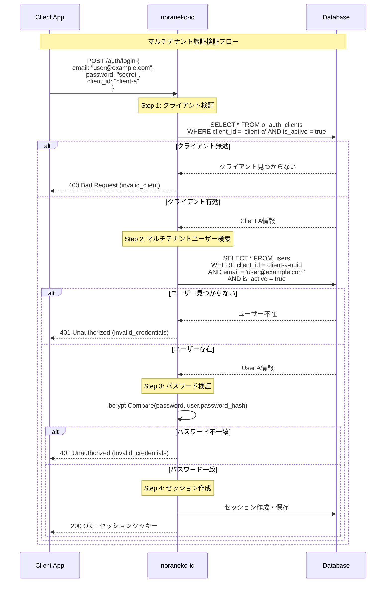
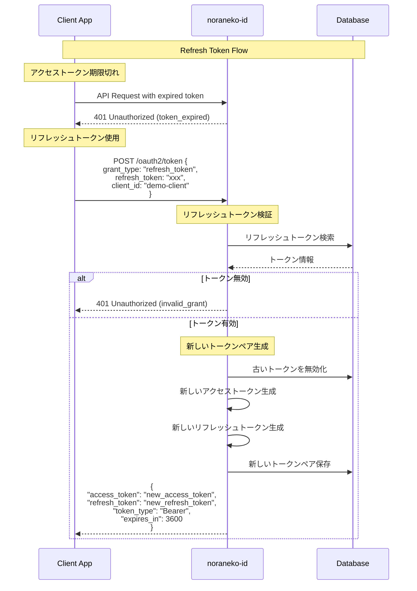
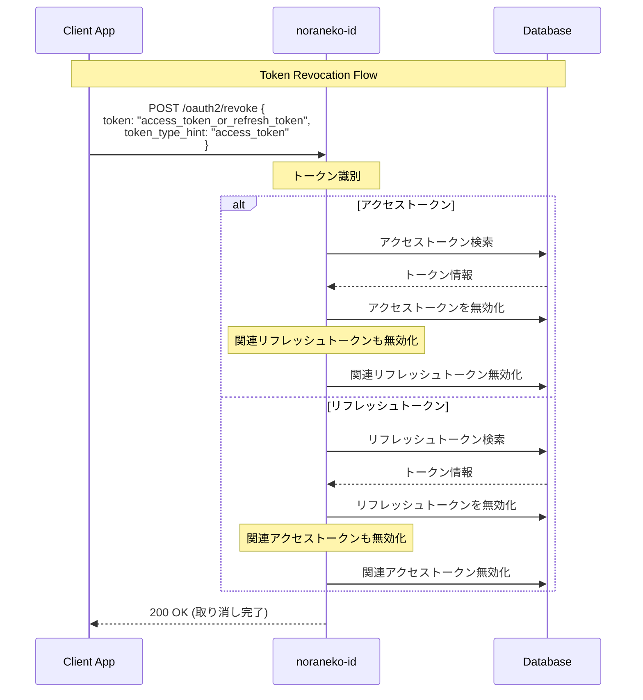
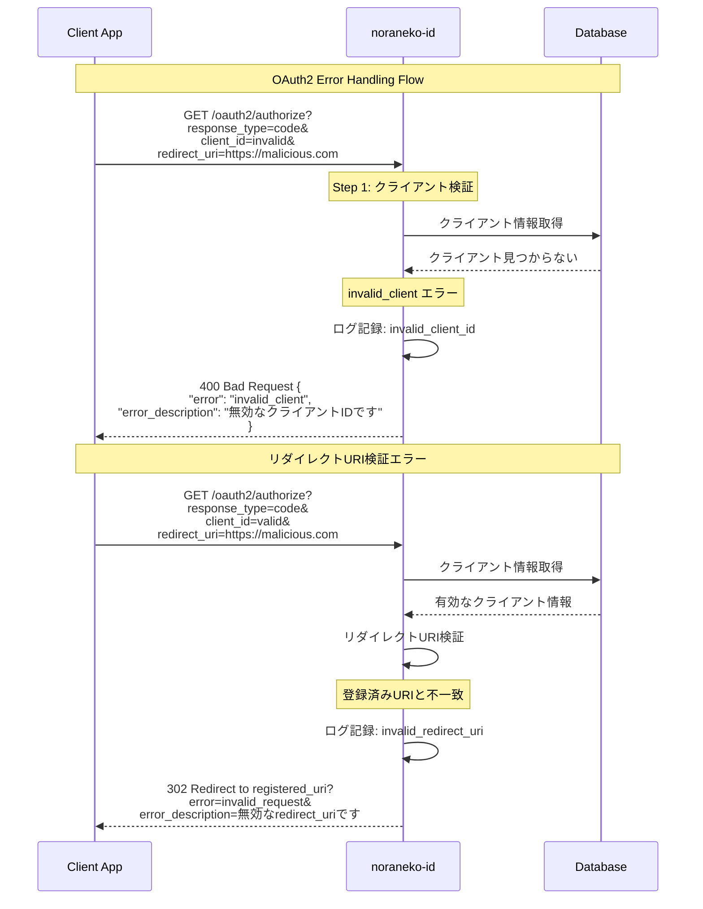
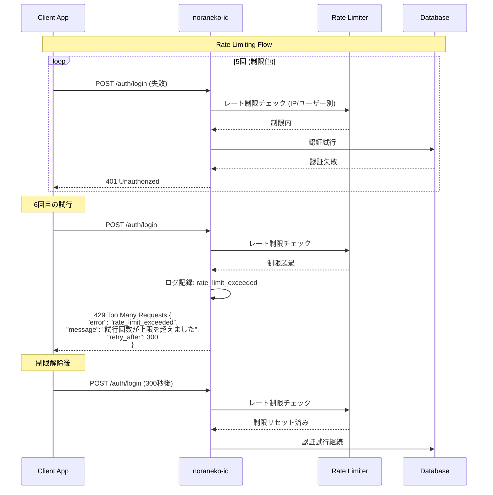

# Sequence Diagrams - シーケンス図

noraneko-id バックエンドの主要処理フローをシーケンス図で詳細に説明します。

## 1. OAuth2 Authorization Code Flow

### 1.1 基本的なOAuth2フロー



### 1.2 PKCE対応OAuth2フロー



## 2. SNS連携認証フロー

### 2.1 Google OAuth2連携



### 2.2 SNS連携での新規ユーザー作成



## 3. マルチテナント認証フロー

### 3.1 クライアント別ユーザー分離



### 3.2 マルチテナント認証検証



## 4. トークン管理フロー

### 4.1 リフレッシュトークンフロー



### 4.2 トークン取り消しフロー



## 5. エラーハンドリングフロー

### 5.1 OAuth2エラーレスポンス



### 5.2 レート制限エラー



## 6. セッション管理フロー

### 6.1 セッション作成と検証

```mermaid
sequenceDiagram
    participant C as Client App
    participant N as noraneko-id
    participant D as Database
    
    Note over C,D: Session Management Flow
    
    Note over C: ログイン成功後
    C->>N: ログイン成功
    
    Note over N: セッション作成
    N->>N: session_token = UUID.new()
    N->>N: session_hash = SHA256(session_token)
    
    N->>D: セッション保存 {<br/>  user_id: user-uuid,<br/>  session_token_hash: session_hash,<br/>  expires_at: now + 24h,<br/>  user_agent: request.user_agent,<br/>  ip_address: request.ip<br/>}
    
    N-->>C: Set-Cookie: session_token=xxx;<br/>HttpOnly; Secure; SameSite=Lax
    
    Note over C,D: 後続のリクエスト
    C->>N: GET /auth/profile (Cookie付き)
    
    Note over N: セッション検証
    N->>N: session_hash = SHA256(cookie.session_token)
    N->>D: セッション検索
    D-->>N: セッション情報
    
    alt セッション有効
        N->>D: ユーザー情報取得
        D-->>N: ユーザー詳細
        N-->>C: ユーザープロフィール
    else セッション無効/期限切れ
        N-->>C: 401 Unauthorized (session_expired)
    end
```

### 6.2 セッション無効化（ログアウト）

```mermaid
sequenceDiagram
    participant C as Client App
    participant N as noraneko-id
    participant D as Database
    
    Note over C,D: Logout Flow
    
    C->>N: POST /auth/logout
    
    Note over N: セッション無効化
    N->>N: session_hash = SHA256(cookie.session_token)
    N->>D: セッション無効化 {<br/>  UPDATE user_sessions<br/>  SET revoked_at = NOW()<br/>  WHERE session_token_hash = session_hash<br/>}
    
    N-->>C: Set-Cookie: session_token=;<br/>Max-Age=0; HttpOnly; Secure
    
    N-->>C: 200 OK {<br/>  "message": "ログアウトしました"<br/>}
    
    Note over C: 後続リクエスト
    C->>N: GET /auth/profile (無効なセッション)
    N->>D: セッション検索
    D-->>N: セッション無効 (revoked_at != NULL)
    N-->>C: 401 Unauthorized (session_revoked)
```