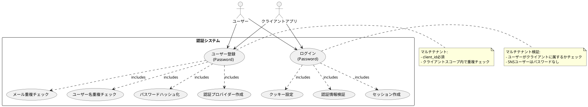
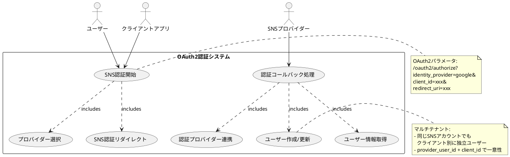
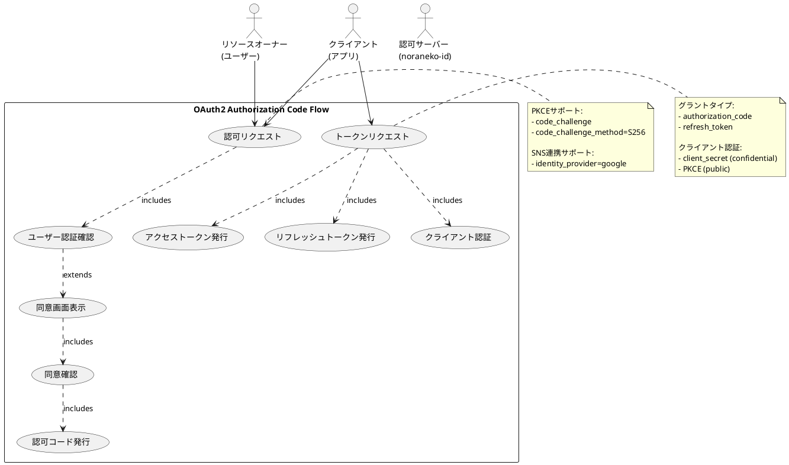
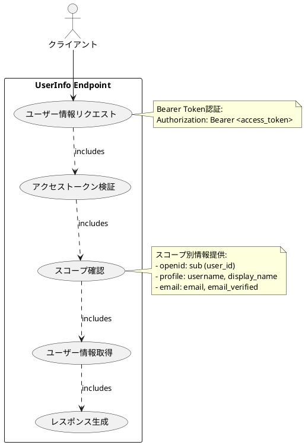
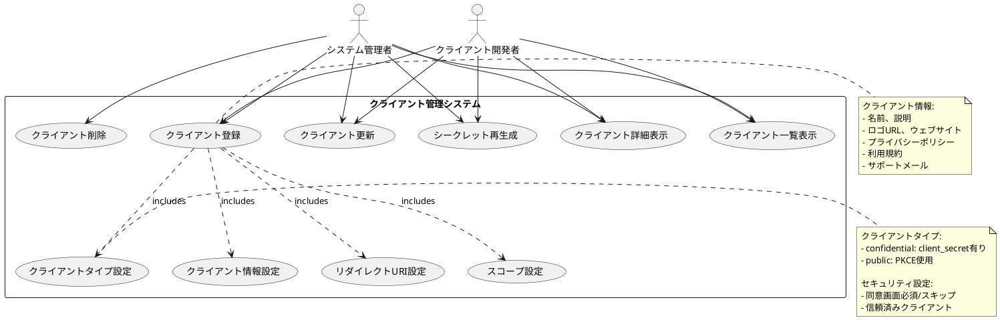
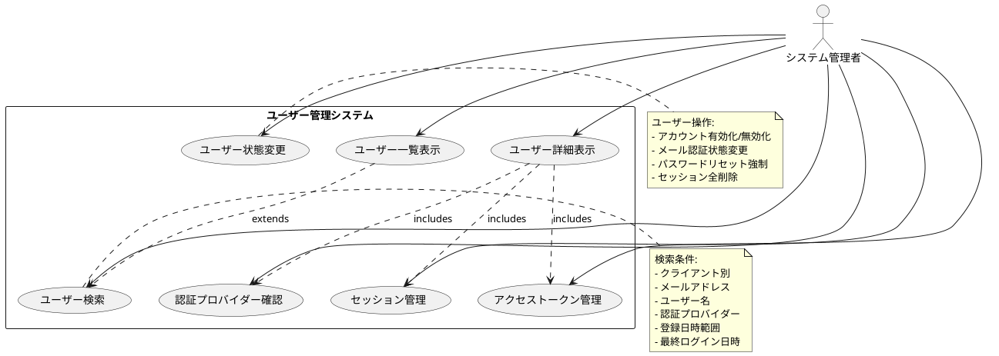
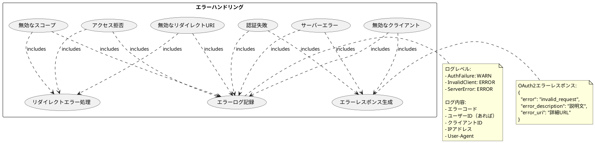
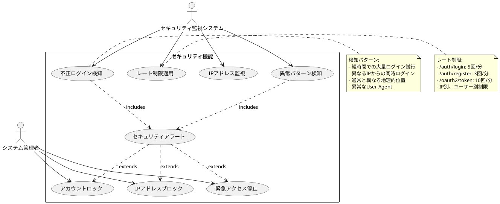

# Use Cases - ユースケース図

noraneko-id バックエンドの主要ユースケースをUML形式で説明します。

## システム全体ユースケース図

```plantuml
@startuml
!define RECTANGLE class

actor "一般ユーザー" as User
actor "クライアントアプリ開発者" as Developer
actor "システム管理者" as Admin

rectangle "noraneko-id System" {
  
  package "認証・認可" {
    usecase "パスワード登録" as UC1
    usecase "パスワードログイン" as UC2
    usecase "SNS連携ログイン" as UC3
    usecase "ログアウト" as UC4
    usecase "プロフィール取得" as UC5
    usecase "セッション管理" as UC6
  }
  
  package "OAuth2フロー" {
    usecase "認可リクエスト" as UC7
    usecase "同意画面表示" as UC8
    usecase "認可コード発行" as UC9
    usecase "アクセストークン発行" as UC10
    usecase "ユーザー情報取得" as UC11
    usecase "トークン取り消し" as UC12
    usecase "トークンリフレッシュ" as UC13
  }
  
  package "クライアント管理" {
    usecase "クライアント登録" as UC14
    usecase "クライアント設定変更" as UC15
    usecase "クライアント削除" as UC16
    usecase "クライアント一覧表示" as UC17
    usecase "クライアントシークレット再生成" as UC18
  }
  
  package "SNS連携管理" {
    usecase "プロバイダー一覧取得" as UC19
    usecase "Google認証連携" as UC20
    usecase "GitHub認証連携" as UC21
    usecase "LINE認証連携" as UC22
  }
}

' ユーザーの関連
User --> UC1
User --> UC2
User --> UC3
User --> UC4
User --> UC5

' 開発者の関連
Developer --> UC7
Developer --> UC8
Developer --> UC9
Developer --> UC10
Developer --> UC11
Developer --> UC12
Developer --> UC13
Developer --> UC14
Developer --> UC15
Developer --> UC16
Developer --> UC17
Developer --> UC18

' 管理者の関連
Admin --> UC14
Admin --> UC15
Admin --> UC16
Admin --> UC17
Admin --> UC18
Admin --> UC19

' システム連携
UC3 --> UC20
UC3 --> UC21
UC3 --> UC22

' 依存関係
UC2 ..> UC6 : includes
UC3 ..> UC6 : includes
UC7 ..> UC8 : includes
UC9 ..> UC10 : extends
UC10 ..> UC13 : extends

@enduml
```

## 1. 認証・認可ユースケース

### 1.1 パスワード認証フロー

### 1.2 SNS連携認証フロー

## 2. OAuth2フローユースケース

### 2.1 Authorization Code Flow

### 2.2 User Info Endpoint

## 3. 管理機能ユースケース

### 3.1 クライアント管理

### 3.2 ユーザー管理（管理機能）

## 4. エラーハンドリングユースケース

### 4.1 認証エラー処理

## 5. セキュリティユースケース

### 5.1 セキュリティ監視

