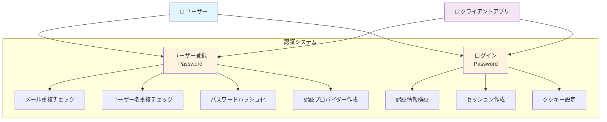
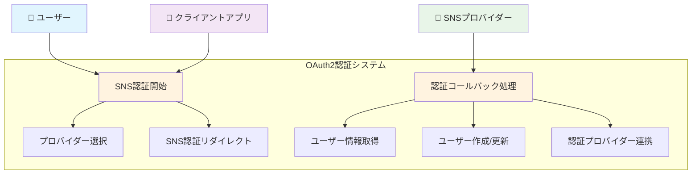
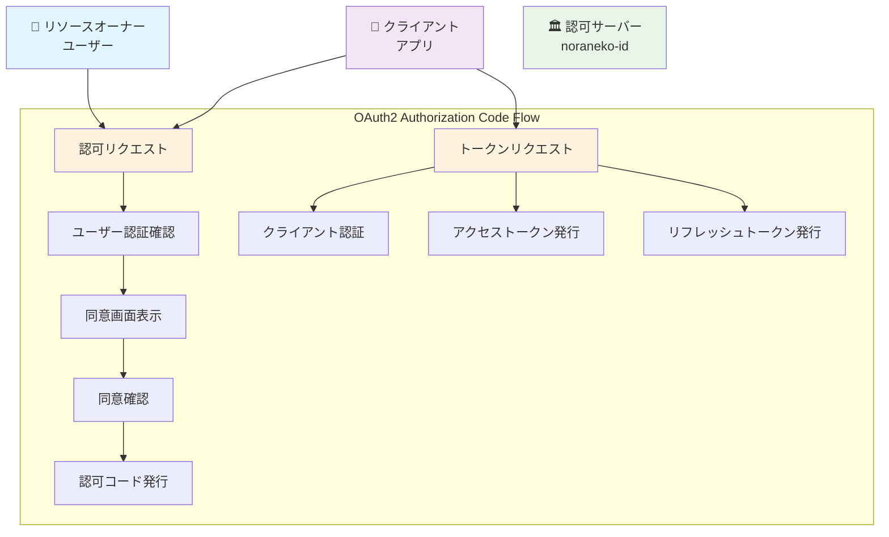
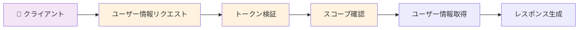
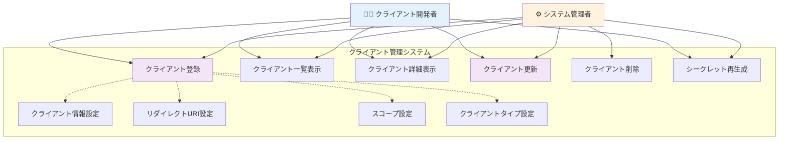
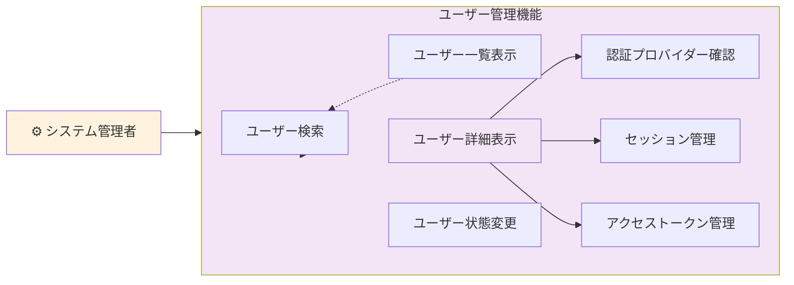
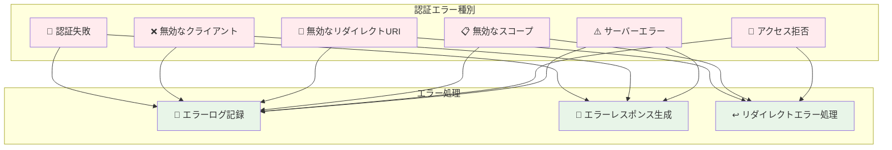
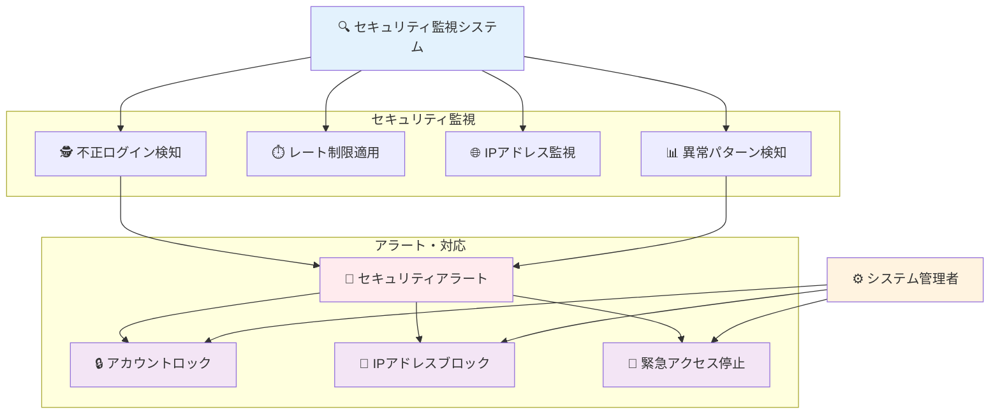

# Use Cases - ユースケース図

noraneko-id バックエンドの主要ユースケースをUML形式で説明します。

## システム全体ユースケース図

```mermaid
graph TB
    %% Actors
    User[👤 一般ユーザー]
    Developer[👨‍💻 クライアントアプリ開発者]
    Admin[⚙️ システム管理者]
    
    %% noraneko-id System
    subgraph "noraneko-id System"
        
        subgraph "認証・認可"
            UC1[パスワード登録]
            UC2[パスワードログイン]
            UC3[SNS連携ログイン]
            UC4[ログアウト]
            UC5[プロフィール取得]
            UC6[セッション管理]
        end
        
        subgraph "OAuth2フロー"
            UC7[認可リクエスト]
            UC8[同意画面表示]
            UC9[認可コード発行]
            UC10[アクセストークン発行]
            UC11[ユーザー情報取得]
            UC12[トークン取り消し]
            UC13[トークンリフレッシュ]
        end
        
        subgraph "クライアント管理"
            UC14[クライアント登録]
            UC15[クライアント設定変更]
            UC16[クライアント削除]
            UC17[クライアント一覧表示]
            UC18[クライアントシークレット再生成]
        end
        
        subgraph "SNS連携管理"
            UC19[プロバイダー一覧取得]
            UC20[Google認証連携]
            UC21[GitHub認証連携]
            UC22[LINE認証連携]
        end
    end
    
    %% User relationships
    User --> UC1
    User --> UC2
    User --> UC3
    User --> UC4
    User --> UC5
    
    %% Developer relationships
    Developer --> UC7
    Developer --> UC8
    Developer --> UC9
    Developer --> UC10
    Developer --> UC11
    Developer --> UC12
    Developer --> UC13
    Developer --> UC14
    Developer --> UC15
    Developer --> UC16
    Developer --> UC17
    Developer --> UC18
    
    %% Admin relationships
    Admin --> UC14
    Admin --> UC15
    Admin --> UC16
    Admin --> UC17
    Admin --> UC18
    Admin --> UC19
    
    %% System integrations
    UC3 --> UC20
    UC3 --> UC21
    UC3 --> UC22
    
    %% Dependencies
    UC2 -.-> UC6
    UC3 -.-> UC6
    UC7 -.-> UC8
    UC9 -.-> UC10
    UC10 -.-> UC13
    
    %% Styling
    classDef userClass fill:#e1f5fe
    classDef systemClass fill:#f3e5f5
    classDef adminClass fill:#fff3e0
    
    class User userClass
    class Admin adminClass
    class Developer systemClass
```



## 1. 認証・認可ユースケース

### 1.1 パスワード認証フロー



**マルチテナント対応:**
- **client_id必須**: 全ての認証でクライアントID指定
- **スコープ分離**: クライアント内でのみ重複チェック
- **SNS対応**: パスワードなしユーザーも対応

### 1.2 SNS連携認証フロー



**OAuth2統合パラメータ:**
```
GET /oauth2/authorize?
  identity_provider=google&
  client_id=demo-client&
  redirect_uri=https://app.com/callback
```

**マルチテナント設計:**
- **完全分離**: 同じSNSアカウントでもクライアント別に独立ユーザー
- **一意性保証**: `provider_user_id + client_id` で重複回避
- **データ独立**: 各クライアントが独自のユーザーベース

## 2. OAuth2フローユースケース

### 2.1 Authorization Code Flow



**PKCE・SNS連携サポート:**
- **PKCE**: `code_challenge`, `code_challenge_method=S256`
- **SNS連携**: `identity_provider=google`

**対応グラントタイプ:**
- `authorization_code` - 標準認可コードフロー
- `refresh_token` - トークンリフレッシュ

**クライアント認証:**
- **Confidential Client**: `client_secret`
- **Public Client**: PKCE使用

### 2.2 User Info Endpoint



**Bearer Token認証:**
```
Authorization: Bearer <access_token>
```

**スコープ別情報提供:**
- **openid**: `sub` (user_id)
- **profile**: `username`, `display_name`
- **email**: `email`, `email_verified`

## 3. 管理機能ユースケース

### 3.1 クライアント管理



**クライアント情報設定内容:**
- **基本情報**: 名前、説明、ロゴURL、ウェブサイト
- **規約・サポート**: プライバシーポリシー、利用規約、サポートメール
- **セキュリティ**: 同意画面必須/スキップ、信頼済みクライアント設定

**クライアントタイプ:**
- **confidential**: client_secret使用、サーバーサイドアプリ向け
- **public**: PKCE使用、SPAアプリ・モバイルアプリ向け

### 3.2 ユーザー管理（管理機能）



**検索・フィルタ条件:**
- **クライアント別**: テナント分離によるクライアント単位表示
- **識別情報**: メールアドレス、ユーザー名での検索
- **認証方式**: パスワード、Google、GitHub、LINE等のプロバイダー別
- **時期条件**: 登録日時範囲、最終ログイン日時での絞り込み

**ユーザー状態管理:**
- **アカウント制御**: 有効化/無効化、アカウントロック
- **認証状態**: メール認証状態変更、パスワードリセット強制
- **セッション制御**: アクティブセッション全削除、強制ログアウト

## 4. エラーハンドリングユースケース

### 4.1 認証エラー処理



**エラーログ記録レベル:**
- **WARN**: 認証失敗（ユーザー起因）
- **ERROR**: システムエラー、無効クライアント
- **INFO**: 正常なアクセス拒否（同意画面で拒否）

**ログ記録内容:**
- エラーコード・メッセージ
- ユーザーID（認証済みの場合）
- クライアントID・IPアドレス・User-Agent
- リクエストパラメータ（機密情報除く）

**OAuth2エラーレスポンス形式:**
```json
{
  "error": "invalid_request",
  "error_description": "日本語エラー説明",
  "error_uri": "https://docs.noraneko-id.com/errors/invalid_request"
}
```

## 5. セキュリティユースケース

### 5.1 セキュリティ監視



**不正ログイン検知パターン:**
- **ブルートフォース**: 短時間での大量ログイン試行
- **分散攻撃**: 異なるIPからの同時ログイン
- **地理的異常**: 通常と異なる地理的位置からのアクセス
- **ボット検知**: 異常なUser-Agent、自動化ツール検知

**レート制限設定:**
- **認証エンドポイント**: `/auth/login` 5回/分、`/auth/register` 3回/分
- **OAuth2エンドポイント**: `/oauth2/token` 10回/分、`/oauth2/authorize` 20回/分
- **管理エンドポイント**: `/admin/*` 30回/分
- **制限単位**: IP別・ユーザー別・クライアント別の階層制限