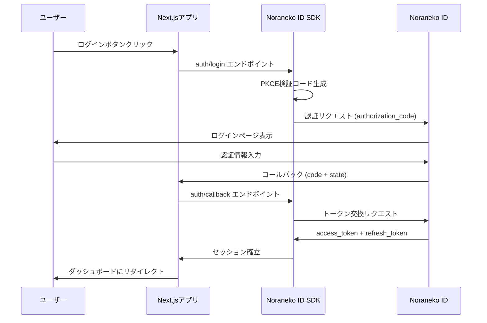

# OAuth2 統合ガイド

このドキュメントでは、Noraneko ID SDK と IDaaS プラットフォーム間の OAuth2 統合について詳しく説明します。

## OAuth2 フロー概要



## IDaaS 側エンドポイント仕様

### 1. 認証エンドポイント (Authorization Endpoint)

**URL:** `{ISSUER}/.well-known/oauth/authorize`
**Method:** GET

#### パラメータ

| パラメータ              | 必須 | 説明                      | SDK 実装箇所             |
| ----------------------- | ---- | ------------------------- | ------------------------ |
| `response_type`         | ✅   | `code` (認証コードフロー) | `createLoginHandler()`   |
| `client_id`             | ✅   | クライアント ID           | `AuthConfig.clientId`    |
| `redirect_uri`          | ✅   | コールバック URI          | `AuthConfig.redirectUri` |
| `scope`                 | ✅   | 要求スコープ              | `AuthConfig.scopes`      |
| `state`                 | ✅   | CSRF 防止トークン         | SDK 自動生成             |
| `code_challenge`        | ✅   | PKCE チャレンジ           | SDK 自動生成             |
| `code_challenge_method` | ✅   | `S256`                    | SDK 固定値               |

#### SDK 実装

```typescript
// src/api/handlers/login.ts
export function createLoginHandler() {
  return async function loginHandler(request: NextRequest) {
    const config = getAuthConfig();
    const { codeVerifier, codeChallenge } = generatePKCE();

    const authUrl = new URL(`${config.issuer}/.well-known/oauth/authorize`);
    authUrl.searchParams.set("response_type", "code");
    authUrl.searchParams.set("client_id", config.clientId);
    authUrl.searchParams.set("redirect_uri", config.redirectUri!);
    authUrl.searchParams.set("scope", config.scopes!.join(" "));
    authUrl.searchParams.set("state", state);
    authUrl.searchParams.set("code_challenge", codeChallenge);
    authUrl.searchParams.set("code_challenge_method", "S256");

    return NextResponse.redirect(authUrl.toString());
  };
}
```

### 2. トークンエンドポイント (Token Endpoint)

**URL:** `{ISSUER}/.well-known/oauth/token`
**Method:** POST
**Content-Type:** `application/x-www-form-urlencoded`

#### 認証コード交換

| パラメータ      | 必須 | 説明                     | SDK 実装箇所              |
| --------------- | ---- | ------------------------ | ------------------------- |
| `grant_type`    | ✅   | `authorization_code`     | `exchangeCodeForTokens()` |
| `code`          | ✅   | 認証コード               | コールバックから取得      |
| `redirect_uri`  | ✅   | コールバック URI         | `AuthConfig.redirectUri`  |
| `client_id`     | ✅   | クライアント ID          | `AuthConfig.clientId`     |
| `client_secret` | ✅   | クライアントシークレット | `AuthConfig.clientSecret` |
| `code_verifier` | ✅   | PKCE 検証コード          | SDK 保存値                |

#### レスポンス

```json
{
  "access_token": "eyJhbGciOiJSUzI1NiIs...",
  "refresh_token": "def50200af3b4...",
  "token_type": "Bearer",
  "expires_in": 3600,
  "scope": "openid profile email"
}
```

#### SDK 実装

```typescript
// src/server/auth.ts
export async function exchangeCodeForTokens(
  code: string,
  codeVerifier: string,
  redirectUri: string
): Promise<Session> {
  const config = getAuthConfig();

  const tokenResponse = await fetch(
    `${config.issuer}/.well-known/oauth/token`,
    {
      method: "POST",
      headers: {
        "Content-Type": "application/x-www-form-urlencoded",
      },
      body: new URLSearchParams({
        grant_type: "authorization_code",
        code,
        redirect_uri: redirectUri,
        client_id: config.clientId,
        client_secret: config.clientSecret!,
        code_verifier: codeVerifier,
      }),
    }
  );

  const tokens: TokenResponse = await tokenResponse.json();

  // ユーザー情報取得
  const userInfo = await getUserInfo(tokens.access_token);

  return {
    user: userInfo,
    accessToken: tokens.access_token,
    refreshToken: tokens.refresh_token,
    expiresAt: Date.now() + tokens.expires_in * 1000,
    scope: tokens.scope,
  };
}
```

### 3. トークンリフレッシュ

| パラメータ      | 必須 | 説明                     | SDK 実装箇所              |
| --------------- | ---- | ------------------------ | ------------------------- |
| `grant_type`    | ✅   | `refresh_token`          | `refreshSession()`        |
| `refresh_token` | ✅   | リフレッシュトークン     | セッションから取得        |
| `client_id`     | ✅   | クライアント ID          | `AuthConfig.clientId`     |
| `client_secret` | ✅   | クライアントシークレット | `AuthConfig.clientSecret` |
| `scope`         | ❌   | スコープ（オプション）   | 元のスコープ継承          |

#### SDK 実装

```typescript
async function refreshSession(refreshToken: string): Promise<Session | null> {
  const config = getAuthConfig();

  const response = await fetch(`${config.issuer}/.well-known/oauth/token`, {
    method: "POST",
    headers: {
      "Content-Type": "application/x-www-form-urlencoded",
    },
    body: new URLSearchParams({
      grant_type: "refresh_token",
      refresh_token: refreshToken,
      client_id: config.clientId,
      client_secret: config.clientSecret!,
    }),
  });

  if (!response.ok) {
    return null;
  }

  const tokens: TokenResponse = await response.json();
  const userInfo = await getUserInfo(tokens.access_token);

  return {
    user: userInfo,
    accessToken: tokens.access_token,
    refreshToken: tokens.refresh_token || refreshToken, // リフレッシュトークンが更新されない場合もある
    expiresAt: Date.now() + tokens.expires_in * 1000,
    scope: tokens.scope,
  };
}
```

### 4. ユーザー情報エンドポイント (UserInfo Endpoint)

**URL:** `{ISSUER}/.well-known/oauth/userinfo`
**Method:** GET
**Authorization:** `Bearer {access_token}`

#### レスポンス

```json
{
  "sub": "user-uuid-12345",
  "email": "user@example.com",
  "email_verified": true,
  "name": "山田太郎",
  "picture": "https://example.com/avatar.jpg",
  "updated_at": 1640995200
}
```

#### SDK 実装

```typescript
async function getUserInfo(accessToken: string): Promise<User> {
  const config = getAuthConfig();

  const response = await fetch(`${config.issuer}/.well-known/oauth/userinfo`, {
    headers: {
      Authorization: `Bearer ${accessToken}`,
    },
  });

  if (!response.ok) {
    throw new Error("Failed to fetch user info");
  }

  const userInfo: UserInfoResponse = await response.json();

  return {
    id: userInfo.sub,
    email: userInfo.email,
    name: userInfo.name,
    image: userInfo.picture,
  };
}
```

### 5. 取り消しエンドポイント (Revocation Endpoint)

**URL:** `{ISSUER}/.well-known/oauth/revoke`
**Method:** POST
**Content-Type:** `application/x-www-form-urlencoded`

| パラメータ      | 必須 | 説明                                       | SDK 実装箇所              |
| --------------- | ---- | ------------------------------------------ | ------------------------- |
| `token`         | ✅   | アクセストークンまたはリフレッシュトークン | `logout()`                |
| `client_id`     | ✅   | クライアント ID                            | `AuthConfig.clientId`     |
| `client_secret` | ✅   | クライアントシークレット                   | `AuthConfig.clientSecret` |

#### SDK 実装

```typescript
// src/api/handlers/logout.ts
export function createLogoutHandler() {
  return async function logoutHandler(request: NextRequest) {
    const config = getAuthConfig();
    const session = await auth();

    if (session) {
      // トークン取り消し
      try {
        await fetch(`${config.issuer}/.well-known/oauth/revoke`, {
          method: "POST",
          headers: {
            "Content-Type": "application/x-www-form-urlencoded",
          },
          body: new URLSearchParams({
            token: session.accessToken,
            client_id: config.clientId,
            client_secret: config.clientSecret!,
          }),
        });
      } catch (error) {
        console.error("Token revocation failed:", error);
      }

      // セッションクリア
      await clearSession();
    }

    // ログアウト後のリダイレクト
    const redirectUrl = request.nextUrl.searchParams.get("callbackUrl") || "/";
    return NextResponse.redirect(new URL(redirectUrl, request.url));
  };
}
```

## Discovery Document

IDaaS は以下のディスカバリー文書を提供する必要があります：

**URL:** `{ISSUER}/.well-known/openid_configuration`

```json
{
  "issuer": "https://auth.example.com",
  "authorization_endpoint": "https://auth.example.com/.well-known/oauth/authorize",
  "token_endpoint": "https://auth.example.com/.well-known/oauth/token",
  "userinfo_endpoint": "https://auth.example.com/.well-known/oauth/userinfo",
  "revocation_endpoint": "https://auth.example.com/.well-known/oauth/revoke",
  "jwks_uri": "https://auth.example.com/.well-known/oauth/jwks",
  "response_types_supported": ["code"],
  "grant_types_supported": ["authorization_code", "refresh_token"],
  "subject_types_supported": ["public"],
  "id_token_signing_alg_values_supported": ["RS256"],
  "scopes_supported": ["openid", "profile", "email"],
  "token_endpoint_auth_methods_supported": ["client_secret_post"],
  "code_challenge_methods_supported": ["S256"]
}
```

## SDK 設定との対応

### 環境変数

```env
# IDaaSの基本設定
NORANEKO_AUTH_ISSUER=https://auth.example.com
NORANEKO_AUTH_CLIENT_ID=your-client-id
NORANEKO_AUTH_CLIENT_SECRET=your-client-secret

# エンドポイント設定（カスタマイズ可能）
NORANEKO_AUTH_REDIRECT_URI=http://localhost:3000/api/auth/callback
NORANEKO_AUTH_SCOPES=openid,profile,email

# セキュリティ設定
NORANEKO_AUTH_COOKIE_PREFIX=noraneko-auth
NORANEKO_AUTH_COOKIE_SECURE=true

# 自動リフレッシュ設定
NORANEKO_AUTH_AUTO_REFRESH_ENABLED=true
NORANEKO_AUTH_AUTO_REFRESH_THRESHOLD=300000
```

### AuthConfig 対応表

| AuthConfig 項目 | IDaaS エンドポイント   | 説明                   |
| --------------- | ---------------------- | ---------------------- |
| `issuer`        | Base URL               | IDaaS のベース URL     |
| `clientId`      | すべてのエンドポイント | OAuth2 クライアント ID |
| `clientSecret`  | token, revoke          | クライアント認証用     |
| `redirectUri`   | authorize, token       | コールバック URI       |
| `scopes`        | authorize              | 要求権限スコープ       |
| `loginPath`     | -                      | SDK 内部パス           |
| `callbackPath`  | -                      | SDK 内部パス           |
| `logoutPath`    | -                      | SDK 内部パス           |

## セキュリティ考慮事項

### 1. PKCE (Proof Key for Code Exchange)

```typescript
// PKCEコード生成
function generatePKCE() {
  const codeVerifier = base64URLEncode(
    crypto.getRandomValues(new Uint8Array(32))
  );
  const codeChallenge = base64URLEncode(
    await crypto.subtle.digest(
      "SHA-256",
      new TextEncoder().encode(codeVerifier)
    )
  );

  return { codeVerifier, codeChallenge };
}
```

### 2. State Parameter

```typescript
// CSRF防止用state生成
function generateState(): string {
  return base64URLEncode(crypto.getRandomValues(new Uint8Array(16)));
}
```

### 3. セキュア Cookie

```typescript
// Cookieセキュリティ設定
cookieStore.set(cookieName, value, {
  httpOnly: true, // XSS防止
  secure: production, // HTTPS必須
  sameSite: "lax", // CSRF防止
  maxAge: sessionDuration,
  path: "/",
});
```

## エラーハンドリング

### OAuth2 エラーレスポンス

IDaaS からのエラーレスポンス形式：

```json
{
  "error": "invalid_grant",
  "error_description": "The provided authorization grant is invalid",
  "error_uri": "https://tools.ietf.org/html/rfc6749#section-5.2"
}
```

### SDK 実装

```typescript
// src/shared/errors.ts
export class OAuthError extends NoranekoAuthError {
  constructor(
    public code: string,
    public description?: string,
    public uri?: string
  ) {
    super(`OAuth Error: ${code}${description ? ` - ${description}` : ""}`);
    this.name = "OAuthError";
  }
}

// エラーハンドリング例
try {
  const tokens = await exchangeCodeForTokens(code, codeVerifier, redirectUri);
} catch (error) {
  if (error instanceof OAuthError) {
    switch (error.code) {
      case "invalid_grant":
        // 認証コードが無効
        break;
      case "invalid_client":
        // クライアント認証失敗
        break;
      case "unsupported_grant_type":
        // サポートされていないgrant_type
        break;
    }
  }
}
```

## テスト用設定

### Mock IDaaS Server

```typescript
// テスト用のモックエンドポイント
const mockEndpoints = {
  authorize: "http://localhost:3001/.well-known/oauth/authorize",
  token: "http://localhost:3001/.well-known/oauth/token",
  userinfo: "http://localhost:3001/.well-known/oauth/userinfo",
  revoke: "http://localhost:3001/.well-known/oauth/revoke",
};

// テスト設定
initializeAuth({
  issuer: "http://localhost:3001",
  clientId: "test-client-id",
  clientSecret: "test-client-secret",
  redirectUri: "http://localhost:3000/api/auth/callback",
  scopes: ["openid", "profile", "email"],
  debug: true,
});
```

## 統合チェックリスト

### IDaaS 側実装確認

- [ ] /.well-known/openid_configuration エンドポイント
- [ ] /.well-known/oauth/authorize エンドポイント
- [ ] /.well-known/oauth/token エンドポイント
- [ ] /.well-known/oauth/userinfo エンドポイント
- [ ] /.well-known/oauth/revoke エンドポイント
- [ ] PKCE 対応 (code_challenge_method=S256)
- [ ] CORS 設定（必要に応じて）

### SDK 側設定確認

- [ ] 正しい issuer URL 設定
- [ ] client_id / client_secret 設定
- [ ] redirect_uri 設定
- [ ] スコープ設定
- [ ] 自動リフレッシュ設定
- [ ] エラーハンドリング

### 動作確認

- [ ] ログインフロー
- [ ] コールバック処理
- [ ] ユーザー情報取得
- [ ] トークンリフレッシュ
- [ ] ログアウト
- [ ] エラーケース対応

このガイドを参考に、IDaaS と SDK の統合を進めてください。
