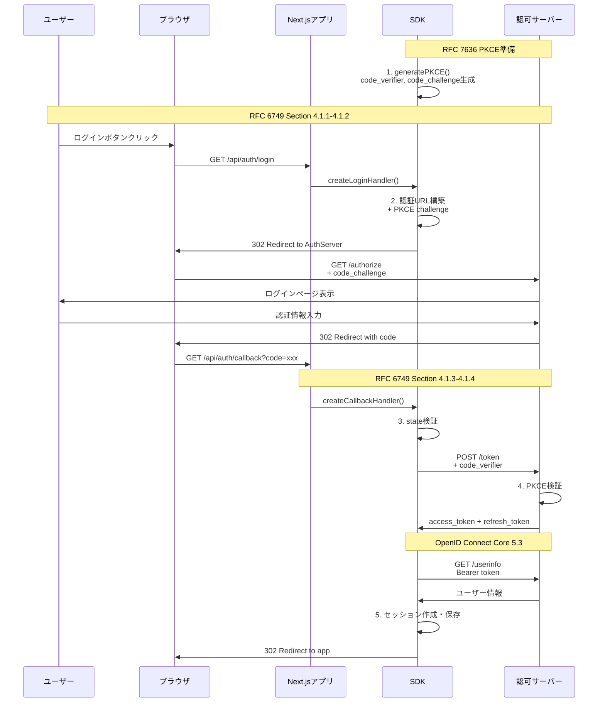
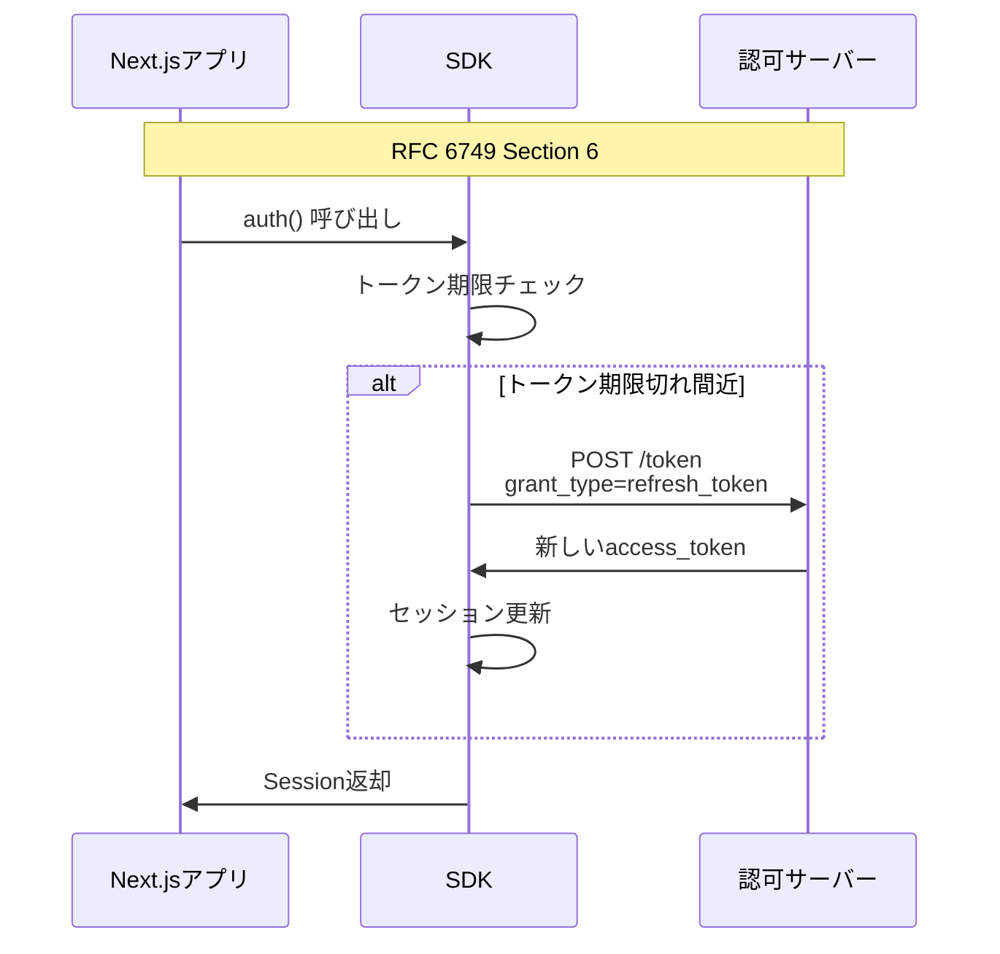
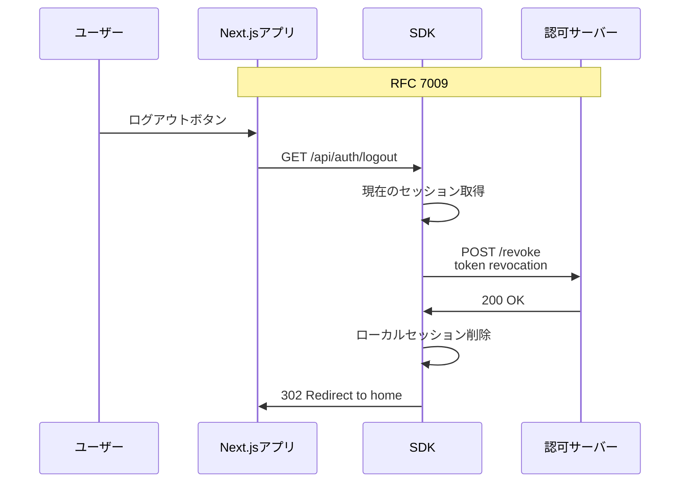

# OAuth2 RFC準拠機能リスト

このドキュメントでは、Noraneko ID SDKで実装しているOAuth2およびOpenID Connect関連のRFC準拠機能について詳しく説明します。

## 実装済みRFC一覧

### 1. OAuth 2.0 (RFC 6749)
**URL:** https://tools.ietf.org/html/rfc6749  
**タイトル:** The OAuth 2.0 Authorization Framework

#### 実装セクション

##### 4.1 Authorization Code Grant
- **4.1.1** Authorization Request
- **4.1.2** Authorization Response  
- **4.1.3** Access Token Request
- **4.1.4** Access Token Response

##### 6. Refreshing an Access Token
- **6** リフレッシュトークンを使用したアクセストークン更新

##### 7. Accessing Protected Resources
- **7** Bearerトークンを使用したリソースアクセス

#### SDK実装詳細

```typescript
// Authorization Code Grant フロー
// 4.1.1 Authorization Request
function createAuthorizationRequest() {
  const params = {
    response_type: 'code',        // RFC 6749 Section 4.1.1
    client_id: config.clientId,   // RFC 6749 Section 4.1.1
    redirect_uri: config.redirectUri, // RFC 6749 Section 4.1.1
    scope: config.scopes.join(' '), // RFC 6749 Section 3.3
    state: generateState(),       // RFC 6749 Section 4.1.1
  }
}

// 4.1.3 Access Token Request
async function exchangeCodeForToken(code: string) {
  const tokenRequest = {
    grant_type: 'authorization_code', // RFC 6749 Section 4.1.3
    code,                            // RFC 6749 Section 4.1.3
    redirect_uri: config.redirectUri, // RFC 6749 Section 4.1.3
    client_id: config.clientId,      // RFC 6749 Section 4.1.3
    client_secret: config.clientSecret, // RFC 6749 Section 2.3.1
  }
}

// 6. Refreshing an Access Token
async function refreshAccessToken(refreshToken: string) {
  const refreshRequest = {
    grant_type: 'refresh_token',  // RFC 6749 Section 6
    refresh_token: refreshToken,  // RFC 6749 Section 6
    client_id: config.clientId,   // RFC 6749 Section 6
    client_secret: config.clientSecret, // RFC 6749 Section 6
  }
}
```

### 2. PKCE (RFC 7636)
**URL:** https://tools.ietf.org/html/rfc7636  
**タイトル:** Proof Key for Code Exchange by OAuth Public Clients

#### 実装セクション

##### 4.1 Client Creates a Code Verifier
- **4.1** コード検証子の生成

##### 4.2 Client Creates the Code Challenge
- **4.2** コードチャレンジの生成（S256メソッド）

##### 4.3 Client Sends the Code Challenge with the Authorization Request
- **4.3** 認証リクエストでのコードチャレンジ送信

##### 4.5 Client Sends the Authorization Code and the Code Verifier to the Token Endpoint
- **4.5** トークンエンドポイントでのコード検証子送信

#### SDK実装詳細

```typescript
// RFC 7636 Section 4.1 & 4.2
function generatePKCE() {
  // 4.1 Code Verifier Generation
  const codeVerifier = base64URLEncode(
    crypto.getRandomValues(new Uint8Array(32))
  )
  
  // 4.2 Code Challenge Generation (S256)
  const codeChallenge = base64URLEncode(
    await crypto.subtle.digest(
      'SHA-256', 
      new TextEncoder().encode(codeVerifier)
    )
  )
  
  return { codeVerifier, codeChallenge }
}

// RFC 7636 Section 4.3
function addPKCEToAuthRequest(authUrl: URL, codeChallenge: string) {
  authUrl.searchParams.set('code_challenge', codeChallenge)
  authUrl.searchParams.set('code_challenge_method', 'S256')
}

// RFC 7636 Section 4.5
function addPKCEToTokenRequest(tokenRequest: URLSearchParams, codeVerifier: string) {
  tokenRequest.set('code_verifier', codeVerifier)
}
```

### 3. OAuth 2.0 Token Revocation (RFC 7009)
**URL:** https://tools.ietf.org/html/rfc7009  
**タイトル:** OAuth 2.0 Token Revocation

#### 実装セクション

##### 2. Token Revocation
- **2.1** Revocation Request
- **2.2** Revocation Response

#### SDK実装詳細

```typescript
// RFC 7009 Section 2.1
async function revokeToken(token: string) {
  const revokeRequest = {
    token,                        // RFC 7009 Section 2.1
    client_id: config.clientId,   // RFC 7009 Section 2.1
    client_secret: config.clientSecret, // RFC 6749 Section 2.3.1
  }
  
  // RFC 7009 Section 2.1
  await fetch(`${config.issuer}/.well-known/oauth/revoke`, {
    method: 'POST',
    headers: {
      'Content-Type': 'application/x-www-form-urlencoded',
    },
    body: new URLSearchParams(revokeRequest),
  })
}
```

### 4. OpenID Connect Core 1.0
**URL:** https://openid.net/specs/openid-connect-core-1_0.html  
**タイトル:** OpenID Connect Core 1.0

#### 実装セクション

##### 3.1.2.1 Authentication Request
- **3.1.2.1** OpenID Connect認証リクエスト

##### 5.3 UserInfo Endpoint
- **5.3.1** UserInfo Request
- **5.3.2** UserInfo Response

#### SDK実装詳細

```typescript
// OpenID Connect Core 1.0 Section 3.1.2.1
function createOIDCAuthRequest() {
  const params = {
    // OAuth 2.0 parameters
    response_type: 'code',
    client_id: config.clientId,
    redirect_uri: config.redirectUri,
    
    // OpenID Connect parameters
    scope: 'openid profile email', // Section 3.1.2.1
    state: generateState(),
  }
}

// OpenID Connect Core 1.0 Section 5.3.1
async function getUserInfo(accessToken: string): Promise<User> {
  const response = await fetch(`${config.issuer}/.well-known/oauth/userinfo`, {
    headers: {
      'Authorization': `Bearer ${accessToken}`, // Section 5.3.1
    },
  })
  
  const userInfo = await response.json()
  
  // Section 5.3.2 Standard Claims
  return {
    id: userInfo.sub,        // Subject Identifier
    email: userInfo.email,   // Email Address
    name: userInfo.name,     // Full name
    image: userInfo.picture, // Profile picture URL
  }
}
```

### 5. OpenID Connect Discovery 1.0
**URL:** https://openid.net/specs/openid-connect-discovery-1_0.html  
**タイトル:** OpenID Connect Discovery 1.0

#### 実装セクション

##### 4. Obtaining OpenID Provider Configuration Information
- **4.1** OpenID Provider Metadata
- **4.2** OpenID Provider Configuration Request
- **4.3** OpenID Provider Configuration Response

#### SDK実装詳細

```typescript
// OpenID Connect Discovery 1.0 Section 4.2
async function discoverConfiguration(issuer: string) {
  const discoveryUrl = `${issuer}/.well-known/openid_configuration`
  const response = await fetch(discoveryUrl)
  const config = await response.json()
  
  // Section 4.3 - Required metadata
  return {
    issuer: config.issuer,
    authorization_endpoint: config.authorization_endpoint,
    token_endpoint: config.token_endpoint,
    userinfo_endpoint: config.userinfo_endpoint,
    jwks_uri: config.jwks_uri,
    // Optional but supported
    revocation_endpoint: config.revocation_endpoint,
  }
}
```

## 認証フロー詳細

### 1. 完全な認証フロー (Authorization Code + PKCE)



### 2. 自動トークンリフレッシュフロー



### 3. ログアウトフロー



## セキュリティ実装

### 1. CSRF Protection (RFC 6749 Section 10.12)

```typescript
// State parameter for CSRF protection
function generateState(): string {
  // RFC 6749 Section 10.12
  return base64URLEncode(crypto.getRandomValues(new Uint8Array(16)))
}

// State validation
function validateState(receivedState: string, expectedState: string): boolean {
  return receivedState === expectedState
}
```

### 2. セキュアCookie実装

```typescript
// RFC 6265準拠のセキュアCookie設定
const cookieOptions = {
  httpOnly: true,           // XSS protection
  secure: isProduction,     // HTTPS only in production
  sameSite: 'lax' as const, // CSRF protection
  maxAge: sessionDuration,  // Expiration
  path: '/',               // Cookie scope
}
```

### 3. PKCE実装 (RFC 7636)

```typescript
// RFC 7636 compliant PKCE implementation
async function generatePKCE() {
  // Section 4.1: code_verifier
  const codeVerifier = base64URLEncode(
    crypto.getRandomValues(new Uint8Array(32))
  )
  
  // Section 4.2: code_challenge with S256
  const encoder = new TextEncoder()
  const data = encoder.encode(codeVerifier)
  const digest = await crypto.subtle.digest('SHA-256', data)
  const codeChallenge = base64URLEncode(new Uint8Array(digest))
  
  return { codeVerifier, codeChallenge }
}
```

## エラーハンドリング (RFC準拠)

### 1. OAuth 2.0エラーレスポンス (RFC 6749 Section 5.2)

```typescript
interface OAuth2Error {
  error: string              // RFC 6749 Section 5.2
  error_description?: string // RFC 6749 Section 5.2
  error_uri?: string        // RFC 6749 Section 5.2
}

// Standard error codes (RFC 6749 Section 5.2)
const OAuth2ErrorCodes = {
  INVALID_REQUEST: 'invalid_request',
  INVALID_CLIENT: 'invalid_client',
  INVALID_GRANT: 'invalid_grant',
  UNAUTHORIZED_CLIENT: 'unauthorized_client',
  UNSUPPORTED_GRANT_TYPE: 'unsupported_grant_type',
  INVALID_SCOPE: 'invalid_scope',
} as const
```

### 2. Authorization Endpoint エラー (RFC 6749 Section 4.1.2.1)

```typescript
// Authorization endpoint error codes
const AuthorizationErrorCodes = {
  INVALID_REQUEST: 'invalid_request',
  UNAUTHORIZED_CLIENT: 'unauthorized_client',
  ACCESS_DENIED: 'access_denied',
  UNSUPPORTED_RESPONSE_TYPE: 'unsupported_response_type',
  INVALID_SCOPE: 'invalid_scope',
  SERVER_ERROR: 'server_error',
  TEMPORARILY_UNAVAILABLE: 'temporarily_unavailable',
} as const
```

## エンドポイント仕様

### 1. 認証エンドポイント

**RFC 6749 Section 3.1**

```http
GET /.well-known/oauth/authorize
?response_type=code
&client_id={client_id}
&redirect_uri={redirect_uri}
&scope={scope}
&state={state}
&code_challenge={code_challenge}
&code_challenge_method=S256
```

### 2. トークンエンドポイント

**RFC 6749 Section 3.2**

```http
POST /.well-known/oauth/token
Content-Type: application/x-www-form-urlencoded

grant_type=authorization_code
&code={authorization_code}
&redirect_uri={redirect_uri}
&client_id={client_id}
&client_secret={client_secret}
&code_verifier={code_verifier}
```

### 3. UserInfoエンドポイント

**OpenID Connect Core 1.0 Section 5.3**

```http
GET /.well-known/oauth/userinfo
Authorization: Bearer {access_token}
```

### 4. トークン取り消しエンドポイント

**RFC 7009 Section 2**

```http
POST /.well-known/oauth/revoke
Content-Type: application/x-www-form-urlencoded

token={token}
&client_id={client_id}
&client_secret={client_secret}
```

## スコープ実装

### 1. OpenID Connect Scopes

```typescript
// OpenID Connect Core 1.0 Section 5.4
const StandardScopes = {
  OPENID: 'openid',     // Required for OpenID Connect
  PROFILE: 'profile',   // Profile claims
  EMAIL: 'email',       // Email claims
  ADDRESS: 'address',   // Address claims
  PHONE: 'phone',       // Phone number claims
} as const

// Default scopes
const defaultScopes = [
  StandardScopes.OPENID,
  StandardScopes.PROFILE,
  StandardScopes.EMAIL,
]
```

### 2. クレーム実装

```typescript
// OpenID Connect Core 1.0 Section 5.1
interface StandardClaims {
  sub: string           // Subject identifier (required)
  name?: string         // Full name
  given_name?: string   // First name
  family_name?: string  // Last name
  email?: string        // Email address
  email_verified?: boolean // Email verification status
  picture?: string      // Profile picture URL
  updated_at?: number   // Last update timestamp
}
```

## RFC準拠チェックリスト

### OAuth 2.0 (RFC 6749)
- ✅ Authorization Code Grant (Section 4.1)
- ✅ Access Token Request/Response (Section 4.1.3-4.1.4)
- ✅ Refresh Token (Section 6)
- ✅ Error Responses (Section 5.2)
- ✅ State Parameter (Section 4.1.1)

### PKCE (RFC 7636)
- ✅ Code Verifier Generation (Section 4.1)
- ✅ Code Challenge Generation S256 (Section 4.2)
- ✅ Authorization Request with Challenge (Section 4.3)
- ✅ Token Request with Verifier (Section 4.5)

### Token Revocation (RFC 7009)
- ✅ Revocation Request (Section 2.1)
- ✅ Revocation Response (Section 2.2)

### OpenID Connect Core 1.0
- ✅ Authentication Request (Section 3.1.2.1)
- ✅ UserInfo Endpoint (Section 5.3)
- ✅ Standard Claims (Section 5.1)

### OpenID Connect Discovery 1.0
- ✅ Provider Configuration (Section 4)
- ✅ Well-known Endpoint (Section 4.2)

### セキュリティ
- ✅ CSRF Protection (RFC 6749 Section 10.12)
- ✅ Secure Cookies (RFC 6265)
- ✅ HTTPS Enforcement (RFC 6749 Section 10.9)
- ✅ Client Authentication (RFC 6749 Section 2.3)

この実装により、OAuth2およびOpenID Connectの主要な仕様に準拠したセキュアな認証システムが提供されます。